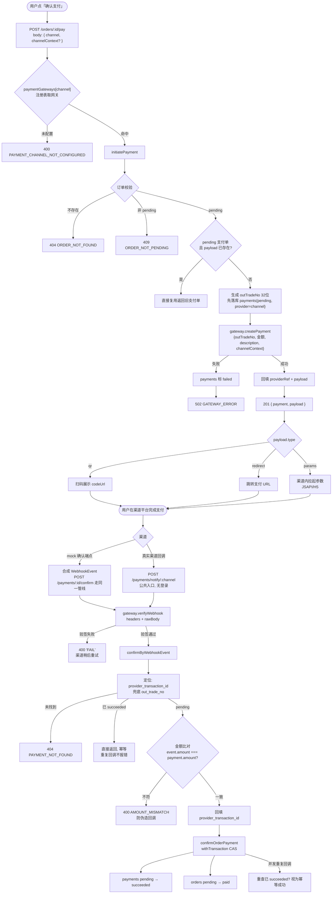
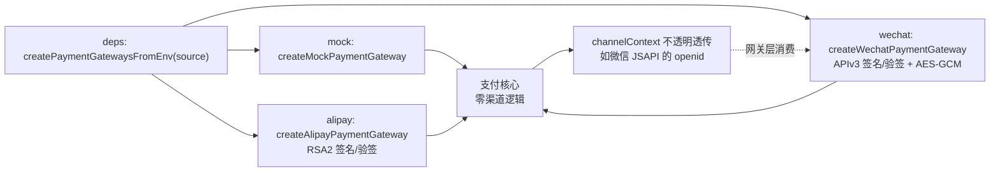
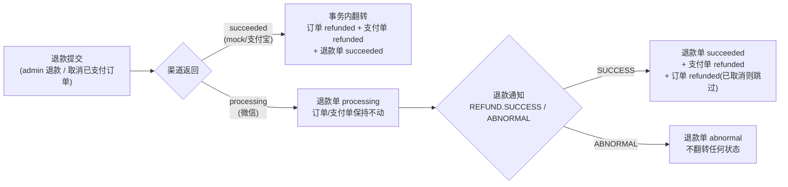
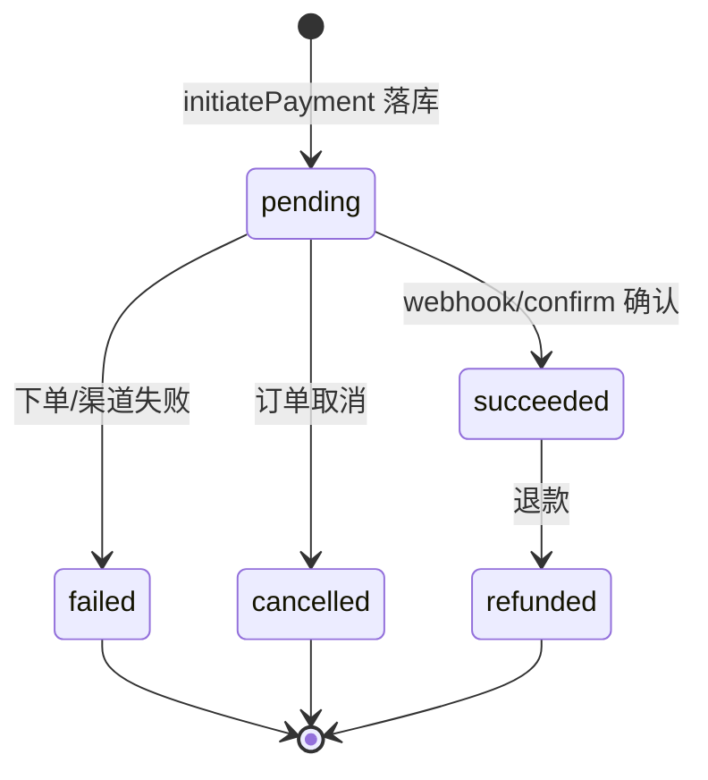

# 支付流程（Payment Flow）

> 当前形态：渠道无关核心 + 渠道注册表 + 三渠道已实现（mock 本地沙箱 / wechat APIv3 / alipay RSA2）。
> 相关代码：`domains/payment`、`usecases/payment-confirm`、`usecases/payment-refund`、`apps/storefront-api/src/routes/payment.ts`。

## 发起支付 → 支付确认 主链路

## 渠道注册表（不绑死任何支付平台）

> 核心（`domains/payment`）不感知任何渠道特有概念（openid、UA、公众号）；
> 前端按 channel 发起，路由按 channel 分发回调，加新渠道 = 注册表一项 + 前端一个支付方式选项。
> 支付配置（`PAYMENT_GATEWAY` + 各渠道 `*_API_BASE`/密钥路径）由 `createPaymentGatewaysFromEnv`
> 统一解析/校验/读 PEM，storefront-api / admin-api / worker 三进程同一来源。
> `PAYMENT_GATEWAY` 支持**逗号分隔多值**（如 `wechat,alipay`），一个部署可同时提供多个渠道；
> 前端 `VITE_PAYMENT_CHANNEL` 提供候选渠道列表，并按**运行环境过滤**（微信内置浏览器只展示微信支付、支付宝内置浏览器只展示支付宝）。

## 渠道网关能力

| 渠道   | 下单                | 回调验签                | 查询(queryPayment)       | 退款(refund)              | 退款查询(refundQuery)     |
| ------ | ------------------- | ----------------------- | ------------------------ | ------------------------- | ------------------------- |
| mock   | 同步返回 qr         | 不支持(走本地确认端点)  | 无(无外部真值, 对账跳过) | 同步成功                  | 无(跳过)                  |
| wechat | APIv3 native        | 平台签名 + AES-GCM 解密 | GET 交易查询             | /v3/refund(异步结果)      | GET refunds/{no}          |
| alipay | 当面付 precreate→qr | RSA2 验签(表单 notify)  | alipay.trade.query       | alipay.trade.refund(同步) | alipay.trade.refund.query |

- **对账**：worker 每 5 分钟扫超 30 分钟 pending 的支付单，`queryPayment` 渠道侧 paid→走幂等确认管线、closed→取消支付单；mock 跳过。
- **退款对账**：同任务扫超 30 分钟仍 processing 的退款单，`refundQuery` 渠道侧 succeeded→走退款通知确认管线、abnormal→标异常；mock 跳过（退款通知丢失兜底）。
- **退款**：`refundOrderWorkflow` 先渠道后本地（确定性退款号 `rf-{paymentId}` 保证重试幂等）；渠道失败不改本地。异步渠道（微信）提交后落**退款单 processing**，订单/支付单保持不动，由**退款通知**驱动终态（见下）。退款通知**金额比对**与支付确认同标准（不符即拒绝，渠道重试）。退款单 **abnormal 后自动换新号重试**（`rf-{paymentId}-{n}`）。

## 退款（异步两段式）

真实渠道（微信）退款是异步的，`refunds` 表记录退款单生命周期：

- 重复提交防护：`out_refund_no` 唯一（确定性派生 `rf-{paymentId}`），已存在退款单直接 409
- 退款通知与支付通知共用 `/payments/notify/:channel` 入口，验签后由 `confirmByWebhookEvent` 分发到 `confirmRefundByWebhookEvent`
- 幂等：退款单/支付单已终态直接返回；未知退款单确认消费（对账兜底）

## 状态机

## 关键设计点

- **幂等**：重复发起复用 pending 单；重复回调/重复确认直接返回，不重复推进订单。
- **金额防伪**：webhook 事件金额与支付单不符即拒绝（`AMOUNT_MISMATCH`）。
- **事务边界**：`confirmByWebhookEvent` 的定位/校验在事务外（只读+单语句原子），状态推进复用 `confirmOrderPayment` 自带事务，避免嵌套 `withTransaction`。
- **迁移**：`0013_pretty_thena.sql` 加 `out_trade_no`（存量 backfill）、`provider_transaction_id` + 部分唯一索引、`payload jsonb`；`0016_refunds_table.sql` 加 `refunds` 退款单表（异步退款状态机，含 `out_refund_no` 唯一 + `payment_id` 索引）。
