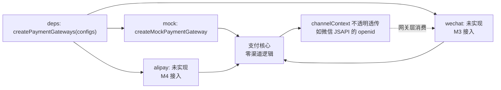
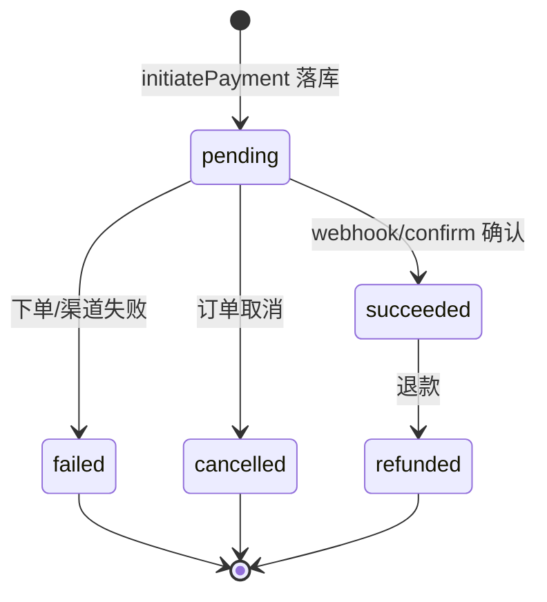

# 支付流程（Payment Flow）

> M1 落地形态：渠道无关核心 + 渠道注册表 + mock 全链路。真实微信/支付宝网关在后续里程碑接入。
> 相关代码：`domains/payment`、`usecases/payment-confirm`、`apps/storefront-api/src/routes/payment.ts`。

## 发起支付 → 支付确认 主链路

## 渠道注册表（不绑死任何支付平台）

> 核心（`domains/payment`）不感知任何渠道特有概念（openid、UA、公众号）；
> 前端按 channel 发起，路由按 channel 分发回调，加新渠道 = 注册表一项 + 前端一个支付方式选项。

## 状态机

## 关键设计点

- **幂等**：重复发起复用 pending 单；重复回调/重复确认直接返回，不重复推进订单。
- **金额防伪**：webhook 事件金额与支付单不符即拒绝（`AMOUNT_MISMATCH`）。
- **事务边界**：`confirmByWebhookEvent` 的定位/校验在事务外（只读+单语句原子），状态推进复用 `confirmOrderPayment` 自带事务，避免嵌套 `withTransaction`。
- **迁移**：`packages/database/src/migrations/0013_pretty_thena.sql` 加 `out_trade_no`（存量 backfill）、`provider_transaction_id` + 部分唯一索引、`payload jsonb`。
